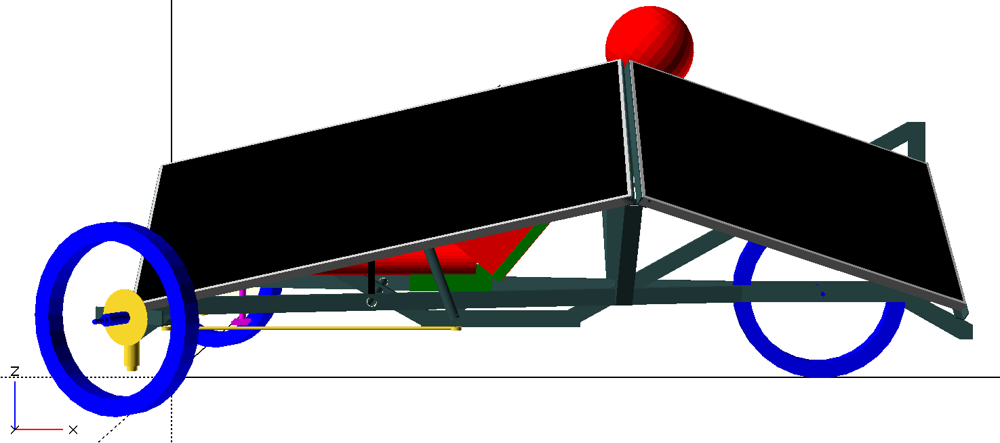

# Solar Bear

A hybrid Sun/muscle-powered trike!

The purpose of the __Solar Bear__ is to:

- Transport people inside cities,
- Reduce the gas emissions,
- Reduce noise inside cities,
- Consume electrical energy where it is produced,
- Use solar panels as trike's body,
- Be safer than a bike,
- Occupy less parking space than a car,
- Motivate people to exercise,
- Motivate people to build their own trike.

# Technical specs

- recumbent trike,
- 2.5m long, 1.45m wide (including wheels),
- weight: 70kg (excluding driver, including panels),
- assisted pedalling,
- motor max speed: 25km/h,
- motor (continuous) power: 250W,
- solar power: max 400W,
- battery: owner choice.

## Maker

[Mihai Oltean](https://mihaioltean.github.io)

## Pictures and videos

[https://www.facebook.com/profile.php?id=61585957465461](https://www.facebook.com/profile.php?id=61585957465461)

## Project inception and location

Town: **Cugir**, country: **Romania**.

## CAD files

[Solar Bear CAD](https://github.com/solar-b/cad)

## Materials and prices

Prices are specific to my region (Cugir, Romania). I have not searched for better prices from distant stores. Prices do not include shipping (because I purchased the materials from nearby stores and the shipping was free).

Will be updated ...

|Material     |Quantity |Unit |Price per unit| Total price (EURO)|Where to buy|
| ----------- | ------- | --- | ------- | ----- | ------ |
rectangular tube (steel) 40x40x2 | 1.4 | m | ? | ? | ? |
rectangular tube (steel) 40x20x2 | 7 | m |  ? | ? | ? |
rectangular tube (steel) 30x20x2 | 80 | cm | ? | ? | ? |
L profile (steel) 25x25 | 3 | m |  ? | ? | ? |
L profile (steel): 30x30 | 67 | cm | ? | ? | ? |
L profile (steel): 40x40: 50cm | ? | ? | ? |
conic bearings | 4 | pcs | ? | ? | ? |
sigma profile (aluminium) 20x20 | 24 | m | ? | ? | ? |
L profile (aluminium): 30x30x3 | 2.5 | m | ? | ? | ? |
wheels (front): 20" | 1 | pcs | , 
wheel (rear): 24" | 1 | pcs | ? | ? | ? |
solar panels (front) Victron 1485x668mm | 2 | pcs|
solar panels (rear) Victron 550x668mm | 2 | pcs | ? | ? | ? |
motor: Bosch Active Line, Cargo | 1 | pcs | ? | ? | ? |
battery: TBD | ? | pcs | ? | ? | ? |
pedals | 1 | set | ? | ? | ? |
chain | 4 | m  | ? | ? | ? |
brakes | 3 | pcs  | ? | ? | ? |
speed changer | 1 | pcs | ? | ? | ? |
lighting system 1 | pcs | ? | ? | ? | 
electrical cable 3 wires | 20 | m | ? | ? | ? | 
horn | 1 | pcs | ? | ? | ? |
screws, nuts, washers (M5, M6, M8, M10, M12)| many | pcs | ? | ? | ? |

## Tools

- Band saw. I have a [PILOUS ARG 130 mobil](https://www.pilous.cz/en/metal/bandsaws/manual/arg-130-mobil). A panel circular saw (with blade for metals) is also good if you do not have a band saw.
- Drill machine. I have a [Milwaukee M18 FDD3](https://www.milwaukeetool.com/).
- Welding machine. I have a [Lorch Handy 160](https://lorch.eu).
- Panel circular saw, (I have a Bosch - GCM 12 SDE).
- Screwdriver (preferably electric).
- Drill bits.
- Many others...

## Software

- [OpenSCAD](https://openscad.org) - for design.
- [Real Cut 1D](https://optimalprograms.com/realcut1d.htm) - for minimizing the waste when cutting linear materias (bars).

## Build instructions

- Cut the bars to required size and angle,
- Build (weld) the structure,
- Reinforce solar panels,
- Place solar panels,
- Connect eletrical installation,
- Go!

More details will be given here, soon ... [instructions.md](instructions.md)

## License

MIT

You may do whatever you want with this information as long as you mention the author.

## Cite as

Mihai Oltean, *Solar Bear; A hybrid trike*, 2025.

## Warning

- I offer *NO warranty* for the information provided in this project!

- I am *NOT an expert* in ANY of the subjects used in the design and construction of this project! 

- Use it, build it, on *your OWN risk*!

- This is a work in progress. Everything might change depending on the experiment results.

## Special thanks to

Dorin Popa, Nicolae Oltean, Cristian Simina, Traian Mărginean, Liviu Știrb, Emil Roșu, Sam Rabern Luck, Dani Cotoară, Mihaela Roșu, Zuga Răzvan, Călin Rusu ... and many others ...