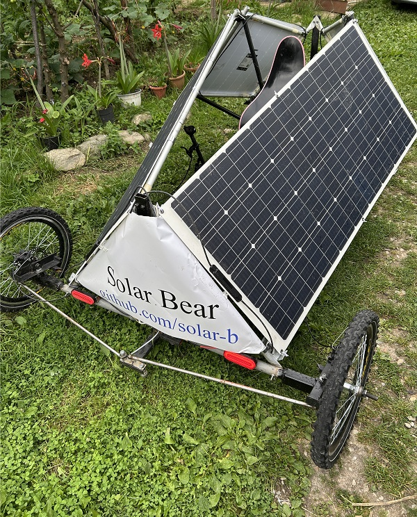

# Solar Bear

A hybrid Sun/muscle-powered trike!

The purpose of the __Solar Bear__ is to:

- Use solar panels as trike's body,
- Consume electrical energy where it is produced,
- Produce its own energy,
- Transport people inside cities,
- Reduce noise inside cities,
- Occupy less parking space than a car,
- Motivate people to build their own trike,
- Motivate people to exercise.

# Technical specs

- recumbent trike,
- 2.5m long, 1.45m wide (including wheels),
- weight: about 55kg (including panels, motor, battery, etc, excluding driver),
- assisted pedaling,
- motor speed: max 25km/h,
- motor (continuous) power: 250W,
- solar panels power: max 520W,
- battery: 12.8V, 20Ah (256Wh).

## Maker

[Mihai Oltean](https://mihaioltean.github.io)

## Pictures and videos

[https://www.facebook.com/profile.php?id=61585957465461](https://www.facebook.com/profile.php?id=61585957465461)

## Project inception and location

Town: **Cugir**, country: **Romania**.

## CAD files

[Solar Bear CAD](https://github.com/solar-b/cad)

## Materials and prices

Prices are specific to my region (Cugir, Romania). I have not searched for better prices from distant stores. Prices do not include shipping (because I purchased the materials from nearby stores and the shipping was free).

Will be updated ...

| Material     | Quantity | Unit |Price per unit (EURO)| Total price | Utilization | Where to buy|
| ----------- | ------- | --- | ------- | ----- | ------ | ------ |
rectangular tube (steel) 30x20x2mm | 4.2 | m |  ? | ? | base frame | local store|
rectangular tube (steel) 15x15x1.5 | 2 | m | ? | ? | panels support | local |
L profile (steel) 25x25 | 90 | cm |  ? | ? | rear side | local |
round tube (steel) 1" | 90 | cm |  ? | ? | front wheels | local |
rectangular tube (steel) 40x40x2 | 0.4 | m | ? | ? | Castor angle | local |
conic bearings  (14/35mm dia)| 4 | pcs | ? | ? | front wheels support | local |
aluminium tubes (25mm) | 12 | m | ? | ? | solar panels frame | local |
wheels (front): 20" | 2 | pcs | ? | ? | | local |
wheel (rear): 26" | 1 | pcs | ? | ? | | local |
solar panels (front) flexible 1510x660mm, 200W | 2 | pcs| 100 | 200 || web |
solar panels (rear) flexible 540x610mm, 60W | 2 | pcs | 50 | 100 | | web |
MPPT (Victron 75/15, 12V) | 4 | pcs | 70 | 280 | | web |
Smartshunt (500A/50mV Victron) | 1 | pcs | 100 | 100 | | web |
motor (mid drive Bafang M820): 250W | 1 | pcs | 600 | 600 | | Alibaba |
battery: 256Wh (Victron 12.8v, 20Ah, LiSP) | 1 | pcs | 200 | 200 | | web |
12V-36V (540W) step-up regulator | 1 | pcs | 50 | 50 | | Amazon |
pedals | 1 | set | ? | ? | | local |
seat | 1 | pcs | 250 | 250 | | Thor composite |
chain | 4 | m  | ? | ? | | local |
brakes | 3 | pcs  | ? | ? | | local |
derailleur (7 speeds) | 1 | pcs | ? | ? | | local |
gear shifter | 1 | pcs | ? | ? | | local |
lighting system | 5 | pcs | ? | ? | | local |
electrical cable | many | m | ? | ? | | local |
horn | 1 | pcs | ? | ? | | local |
screws, nuts, washers (M5, M6, M8, M10, M12)| many | pcs | ? | ? | everywhere | local |

## Tools

- Drill / screw driver machine. I have a [Milwaukee M18 FDD3](https://www.milwaukeetool.com/).
- Welding machine. I have a [Lorch Handy 160](https://lorch.eu).
- Grinding/metal cutting machine. I have a [Milwaukee M18FSAG125X](https://www.milwaukeetool.com/).
- Drill bits.
- Many others...

## Software

- [OpenSCAD](https://openscad.org) - for 3D design.
- [Real Cut 1D](https://optimalprograms.com/realcut1d.htm) - for minimizing the waste when cutting linear materias (bars) (if you have a lot of bars to cut from).

## Build instructions

- Cut the bars to required size and angle,
- Build (weld) the structure,
- Install the motor, battery,
- Make the eletrical installation,
- Install the solar panels,
- Go!

More details will be given here, soon ... [instructions.md](instructions.md)

## License

MIT

You may do whatever you want with this information as long as you mention the author.

## Cite as

Mihai Oltean, *Solar Bear; A hybrid trike*, 2025.

## Warning

- I offer *NO warranty* for the information provided in this project!

- I am *NOT an expert* in ANY of the subjects used in the design and construction of this project! 

- Use it, build it, on *your OWN risk*!

- This is a work in progress. Everything might change depending on the experiment results.

## Special thanks to

Dorin Popa, Nicolae Oltean, Cristian Simina, Traian Mărginean, Liviu Știrb, Emil Roșu, Sam Rabern Luck, Dani Cotoară, Mihaela Roșu, Zuga Răzvan, Călin Rusu ... and many others ...