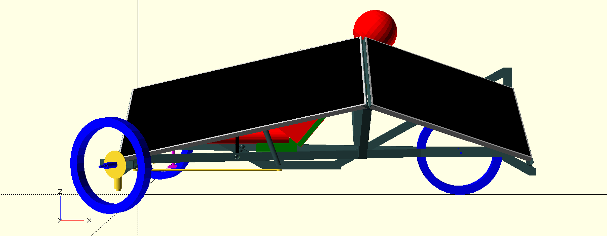

# Solar Bear

A solar trike

The purpose of the __Solar Bear__ is to:

## Why Solar Bear?

Because:

## Maker

[Mihai Oltean](https://mihaioltean.github.io)

## Project location

Town: **Cugir**, country: **Romania**.

## CAD files

[Solar Bear CAD](https://github.com/solar-b/cad)

## Materials, tools and software

Brief instructions are given below. More details are in the links.

### Materials

All units are in mm.

### Tools

- Band saw (able to cut 80x40mm rectangular tube at 52 degrees angle). I have a [PILOUS ARG 130 mobil](https://www.pilous.cz/en/metal/bandsaws/manual/arg-130-mobil).
- Drill machine. I have a [Milwaukee M18 FDD3](https://www.milwaukeetool.com/).
- Welding machine. I have a [Lorch Handy 160](https://lorch.eu).
- Screwdriver (preferably electric).
- Drill bits.
- Many others...

### Software

- [OpenSCAD](https://openscad.org) - for design.
- [Real Cut 1D](https://optimalprograms.com/realcut1d.htm) - for minimizing the waste when cutting bars.

## Build instructions

- Cut the bars to required size and angle,
- Build (weld) the structure,

More details are in [instructions.md](instructions.md)

## Cost

- Prices do not include manufacturing (which I did it by myself) and tools (which I already have).

- Prices are specific to my region (Cugir, Romania). I have not searched for better prices from distant stores. Prices do not include shipping (because I purchased the materials from nearby stores and the shipping was free).

- Prices include VAT.

|Material     |Quantity |Unit |Price per unit| Total price (EURO)|
| ----------- | ------- | --- | ------- | --- |

Will be updated ...

## Pictures and videos

A video ...

Pictures are [here](../pictures/).

## License

MIT. You may do whatever you want with this information as long as you mention the author.

## Warning

- I offer *NO warranty* for the information provided in this project!

- I am *NOT an expert* in ANY of the subjects used in the design and construction of this project! 

- Use it on *your OWN risk*!

- This is a work in progress. Everything might change depending on the experiment results.

## Cite as

Mihai Oltean, *Solar Bear; A solar trike*, 2025.

## Special thanks to

Dorin Popa, Nicolae Oltean, Emil Roșu, Cristi Simina, ... and many others ...